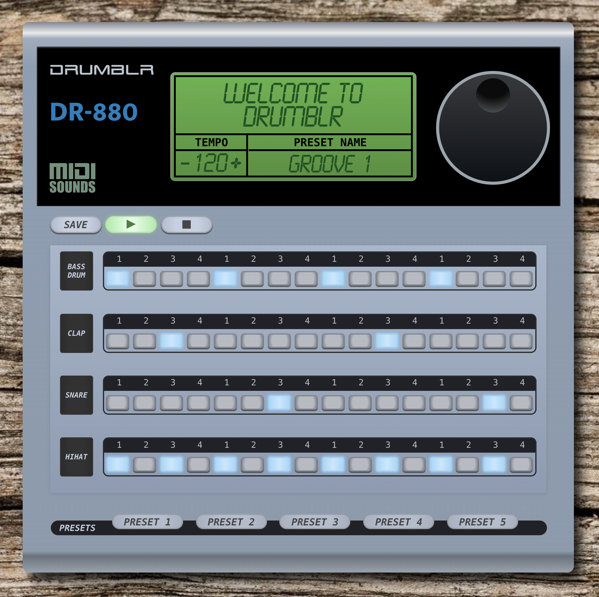

Designed as an homage to late 80's/early 90's drum machines, Drumblr is a digital drum machine users can play in the browser, with customizable tempo, rhythms, and presets.



Drumblr uses the midi-sounds-react library (https://www.npmjs.com/package/midi-sounds-react) for samples, allowing users to play and update beats in real time.

Drumblr was made with a React frontend and a Ruby on Rails backend. Here's a demo video to show you how it works: https://www.youtube.com/watch?v=DZ0mmeFn3Ic

Check out the backend code here: https://github.com/kev-kev/drumblr-backend

To use: 

```// clone backend first
$ git clone git@github.com:kev-kev/drumblr-backend.git

// cd into backend folder
$ cd drumblr_backend

// install dependencies and start the server
$ bundle && rails s

// clone this repository
$ git clone git@github.com:kev-kev/drumblr-frontend.git 

// cd into the repository
$ cd drumblr_frontend

// install dependencies and run the app
$ npm install && npm start
```
© 2020 - Created by Kevin Clark, Christopher Leja, and Ryan Seit

